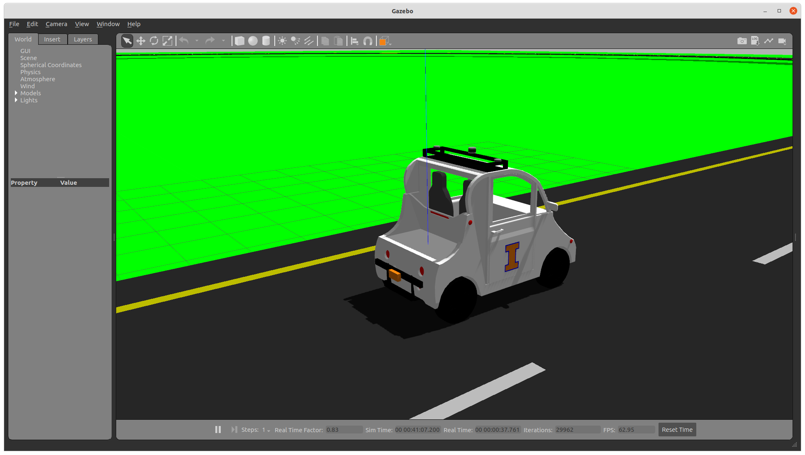

# TII-vehicleics-Integration-Engineer-Challenge
## ROS Path-Tracking Controller with State Machine

This project implements a ROS-based path-tracking controller using a Pure Pursuit algorithm and a navigation state machine. The project is containerized using Docker, with separate development and production environments managed via Docker Compose.


## Design Choices and Architecture

### 1. **Path-Tracking Algorithm**

The Pure Pursuit algorithm was chosen for its simplicity and effectiveness in path-following scenarios. It computes a steering angle to keep the vehicle on a predefined path by constantly aiming at a target point ahead of the vehicle. The algorithm is well-suited for real-time applications, making it a robust choice for this project.

- **Key Components**:
  - **Waypoint Transformation**: Transforms global waypoints into the vehicle's coordinate frame to ensure accurate path tracking.
  - **Steering Angle Calculation**: Computes the steering angle based on the target waypoint and the vehicle’s current position and orientation.

### 2. **State Machine**

The state machine is designed to manage different operational states of the vehicle, such as "Idle," "Path Following," and "Completed." The use of a state machine adds robustness to the system by clearly defining behaviors for each state and ensuring smooth transitions between them.

- **Key States**:
  - **Idle**: The vehicle waits for a path or command.
  - **Path Following**: The vehicle actively follows the path using the Pure Pursuit controller.
  - **Completed**: The vehicle stops following the path once it has reached the end.

## Results

### 1. **RViz Visualization**

In this section, we showcase the path and position in RViz, using a red marker to represent the vehicle’s current location.


*Figure 1: RViz visualization showing the vehicle's path and its position.*

### 2. **Gazebo Simulation**

Here, we demonstrate the vehicle following the path in the Gazebo simulation environment. The video shows the vehicle moving along the predefined path, successfully reaching the destination.

[](media/pure_pursuit_path_tracking_001_2024年08月30日.webm)

*Figure 2: Gazebo simulation showing the vehicle following the path.*

## Prerequisites

- [Docker](https://docs.docker.com/get-docker/)
- [Docker Compose](https://docs.docker.com/compose/install/)
- X11 server running on your host machine (for GUI applications)

## Getting Started

### 1. Clone the Repository

```bash
git clone https://github.com/lp-karim/TII-vehicleics-Integration-Engineer-Challenge
cd TII-vehicleics-Integration-Engineer-Challenge
```

### 2. Build the Docker Containers

Use Docker Compose to build the containers:

```bash

docker compose up --build -d
```
### 3. Running GUI Applications

Make sure to expose your X11 socket to be able to Rviz and Gazebo:

```bash

xhost +local:docker
```

## Further Development

- **Unit Testing**: Use gtest to write and run unit tests for each component.
- **Code Coverage**: Use gcov or lcov to measure code coverage and aim for 80% coverage.
- **Extend State Machine**: Add more states to the state machine, such as obstacle avoidance.